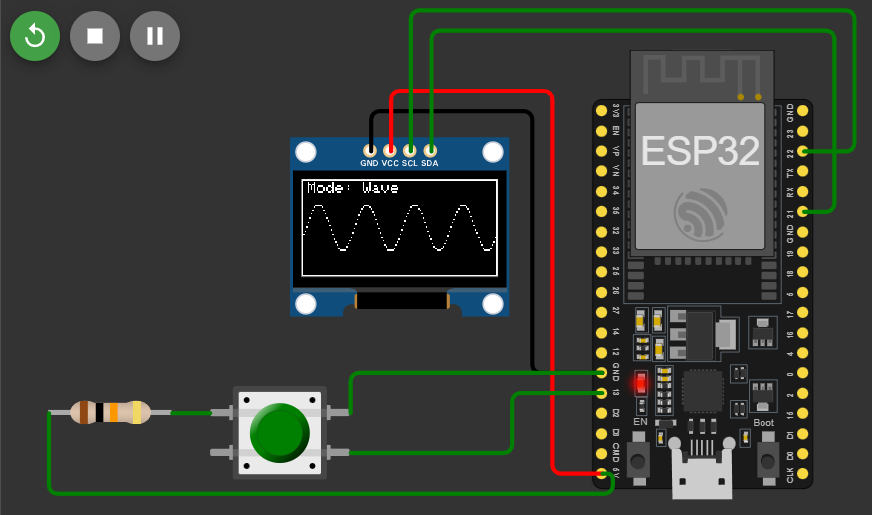
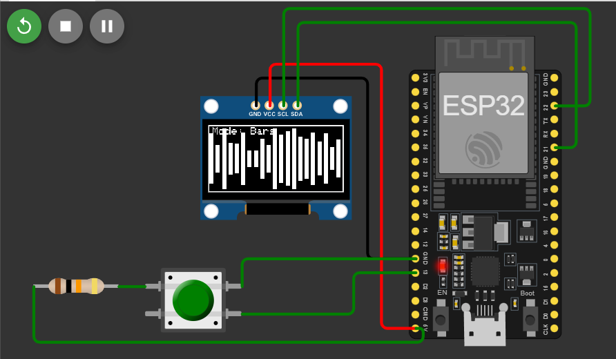

# ESP32 OLED Music Visualizer (Simulated)

A **real-time music visualizer** built on ESP32 + 128x64 OLED, simulating groovy **waveforms** and **audio bars** — all without needing any real hardware(cause I'm Broke).

---

## Features

- Toggle between *Waveform Mode* and *Bar Mode* with a single button  
- Clean OLED UI with animated visuals  
- Runs entirely in **simulation** — no soldering, no stress  
- Designed to be **microphone-ready** for future real-time audio input  
- Built with Arduino Framework for max flexibility

---

## Tech Stack

- **ESP32** (simulated)
- **SSD1306 OLED** (128x64, I2C)
- **Wokwi** online simulator
- **Arduino** C++

---

## Demo

---

## Future Roadmap (v2)

Want to take it to the next level?

- Add real mic input with **MAX9814 / INMP441**
- Real-time **FFT audio spectrum analysis**
- Add addressable **LED strip** (WS2812B) for synced lighting
- Show actual sound data instead of fake noise
- Make it respond to “Thomas the Tank Engine x Drill Remix.”

---

## Getting Started

1. Fork this repo or clone it  
2. Open `main.ino` in [Wokwi](https://wokwi.com/)  
3. Click **Run**  
4. Press the button to toggle visualization mode  
5. And see the bars and waves move( clap! clap! clap!).

---

## Inspirations

Classic music visualizers from Winamp, old-school MP3 players, and *some free time.*

---

## Contributing

Pull requests welcome — whether it's better visuals, mic integration, or making it *look cooler*. Hack away.

---

## License

MIT — go make weird stuff.
